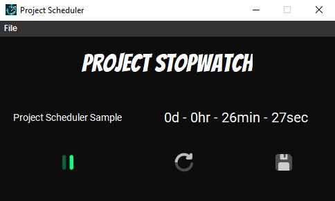
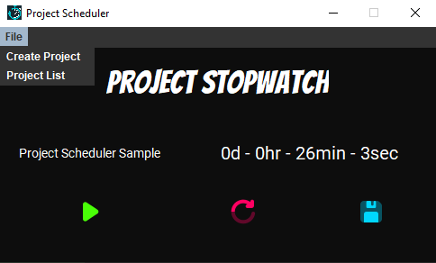
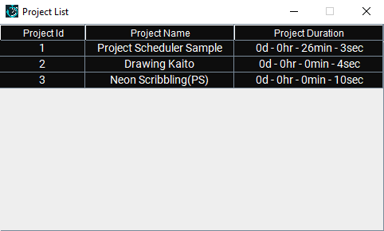

# Project Stopwatch
-logo
a stopwatch for a specific task/project/activity
## Output


* Contains
	* Main - main class method
	* MainFrame - Main JFrame(view1)
	* MainPanel - Main JPanel(view2)
	* ProjectListFrame - JFrame for selecting Project(view3)
	* Stopwatch - The timer
	* Task - The model of a project(model)
	* Controller - Contains all changes from view-model-db vice-versa(controller)
	* SecondsUtils - Utilities for formatting seconds	

* Assets: 
	* Bangers-Regular.ttf
	* Roboto-Regular.ttf
	* mysql-connector-java-8.0.29.jar

* Resources: 
	* logo.png
	* logo_only.png
	* logo_only_transparent.png
	* logo_transparent.png
	* pause_32px.png
	* reset32px.png
	* save_32px.png
```
Source Code: https://github.com/ParasoI/ProjectStopwatch
```

### Main.java
* The main class of the program that instantiates MainFrame, MainPanel, ProjectListFrame, Task, Stopwatch, Controller.
* MVC - Controller has reference of the views and the model
* Initiates the controller
```
MainFrame view1 = new MainFrame();
MainPanel view2 = new MainPanel();
ProjectListFrame view3 = new ProjectListFrame();
Task model = new Task(0,"0",0);
Stopwatch stopwatch = new Stopwatch();
Controller controller = new Controller(view1, view2, view3, model, stopwatch);

controller.init();
``` 

### MainFrame.java


* Extends the JFrame class.
* Instantiates a custom JFrame.
* Size: 500 * 300
* Has Default Layout
* Create a JMenuBar with File Menu
* File Menu with Create Project, and Project List
	* Create Project - Create a new database entry and load it to the view
	* Project List -  Show a table of projects from databasae within a ProjectListFrame(can open/delete a project)
* Contains a MainPanel


### MainPanel.java



* Extends the Jpanel class.
* Instantiates a custom JPanel.
* Size 500 * 300
* Has Gridbag Layout
* Creates 3 JLable, and 3 JButton
	* Lable1 = Software Title
	* Lable2 = Project Title
	* Lable3 = Project Duration
	* Button1 = Play/Pause Button
	* Button2 = Reset Button
	* Button3 = Save Button

### ProjectListFrame.java



* Extends the JFrame class.
* Instantiates a custom JFrame.
* Size: 500 * 300
* Has Default Layout
* Create and Contain JTable that list all of Projects in the database
* Has Open/Delete a project feature by right-clicking a row in JTable

### Stopwatch.java

* A timer class dedicated to keeping time by utilizing System.currentTimeMillis()
Ex.
```
long start = System.currentTimeMillis();
Thread.sleep(1000);
long end = System.currentTimeMillis();
int duration = (int)((end - start) / 1000);

//duration will be 1sec, same as sleep counter
```

* Create variables to store:
	* elapsed time for the session
	* start of the time when play button is clicked
	* end of the time when pause button is clicked
	* value to check if the stopwatch is playing or paused
```
private long elapsed;
private long currentStart;
private long currentEnd;
private boolean isPlaying;
```

### Task.java

* The model class
* Creates a copy of a row in the task table in database
* Create variables to store:
	* Task ID from database
	* Task Name from database
	* Task Duration from database
	* Task Running Duration in the session(Stopwatch)
```
private int taskId;
private String taskName;
private long taskDuration;
private long runningDuration;
```

### SecondsUtils.java

* Static class dedicated for converting seconds to days,hours,minutes,seconds format

Example Snippet:

```
public static int MINUTES = 60;
    public static int HOURS = 60;
    public static int DAY = 24;

    public static int toDays(long secondsDB){
        int days = 0;

        days = (int)(secondsDB / MINUTES / HOURS / DAY);
        return days;
    }
```

### Database.java

* Static class that ontains the URL, username, and password of the database connection

### Controller.java

* Has reference of the views, and the model
* Implements ActionListener
* Contains all of the actions between the view->model->database vice-versa

## The Database
* DB is MySQL hosted from:
```
https://remotemysql.com/
```
## How to Install?
* Download the source code
* Load it in Intellij IDE
* From the assets folder, add mysql-connector-java-8.0.29.jar to project libraries -> classes
* From the assets folder, install the fonts Bangers-Regular.ttf, and Roboto-Regular.ttf
* Load the main method
